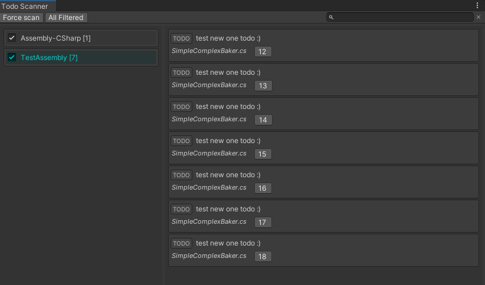

# Unity editor todo scanner.
### Significant fork differences:
- Group todo by assemblies.
- Enable/disable scan assemblies.
#### minor:
- added button for open script.

#### Install UPM:
```git
https://github.com/Tokars/UnityTodoScanner.git#upm
```

### How To Use
Open editor window `Windows > Todo Scanner` press `Scan` btn.




